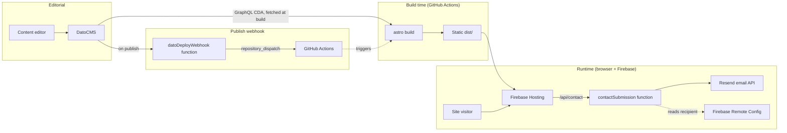

# Architecture

## Conceptual architecture

The site is statically generated: there is no application server rendering pages per-request. Content comes from DatoCMS at build time; the only runtime backend logic is two narrowly-scoped Firebase Functions.

Key properties:

- **No per-request rendering.** `astro build` runs once per deploy; every `.astro` page's frontmatter (including all DatoCMS fetches) executes at that point, not when a visitor requests the page.
- **Two narrow server-side responsibilities**, both as Firebase Functions, not a general backend: forwarding contact form submissions to email, and rebuilding the site when content is published.
- **Remote Config is used only where a value is read at runtime**, e.g. `contact_recipient_email` inside `contactSubmission`. Build-time-only values (GA measurement ID, nav items) are plain constants in source — Remote Config would add a runtime dependency without ever skipping a rebuild, since the static HTML is already baked.

## Component architecture

```mermaid
flowchart TB
    subgraph Pages["src/pages/*.astro"]
        Home[index.astro]
        About[about.astro]
        Services[services.astro]
        Projects[projects/index.astro]
        ProjectDetail["projects/[slug].astro"]
        Contact[contact.astro]
    end

    Base["layouts/Base.astro<br/>(head, GA4, Header, Footer)"]
    Pages --> Base

    subgraph DataLayer["lib/"]
        FetchDato[datocms.ts: fetchDato]
        Queries[queries/*.ts]
    end
    Pages --> Queries --> FetchDato

    subgraph UI["components/ (atomic) + sections/"]
        Atoms[atoms/]
        Molecules[molecules/]
        Organisms[organisms/]
        Sections[sections/ — page-glue, e.g. ContactFormSection]
    end
    Pages --> Sections
    Pages --> Organisms
    Organisms --> Molecules --> Atoms

    Sections -->|"fetch('/api/contact')"| ContactFn[Functions: contactSubmission]
    Base -->|gtag.js| GA4[GA4]

    FetchDato -->|GraphQL CDA| DatoCMS[(DatoCMS)]
```

Conventions this reflects:

- **Atomic component structure**: `atoms/` → `molecules/` → `organisms/`, composed into pages. `sections/` holds thin page-glue components (e.g. [`ContactFormSection.tsx`](../src/sections/ContactFormSection.tsx)) that own side effects like form submission and analytics, keeping the underlying organism (`ContactForm`) presentational.
- **One query module per page** under `lib/queries/`, each exporting a GraphQL query string plus its matching TypeScript response type, consumed via `fetchDato<T>(QUERY)` in the page's frontmatter.
- **Selective hydration**: most organisms render statically; only interactive ones (`Header`, `ServicesShowcase`, the contact form) carry `client:load`. `Footer` is intentionally never hydrated, which is why click tracking in `Base.astro` uses a delegated `document` listener instead of React event handlers.
