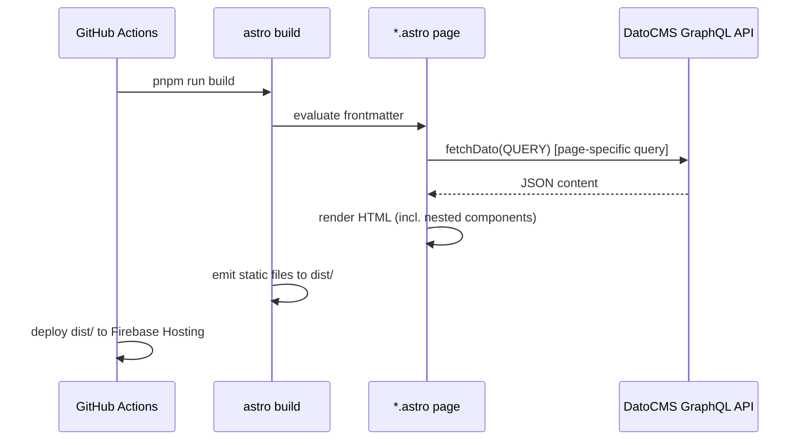
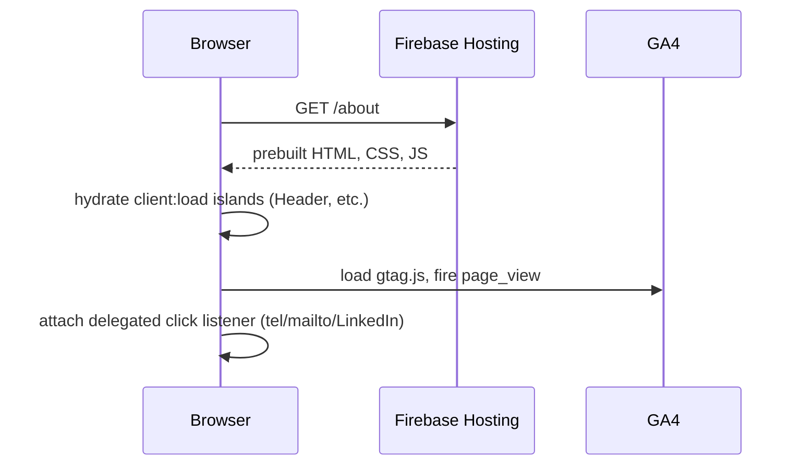
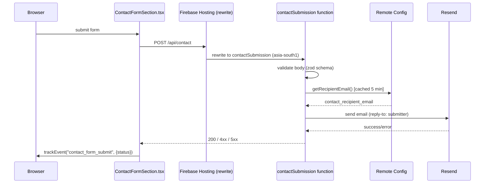
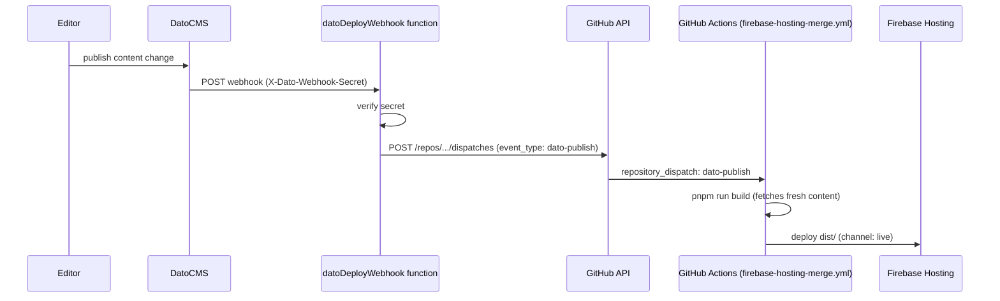

# Sequence Diagrams

## 1. Page build (every deploy)

Runs once per build in CI, not per visitor request.

## 2. Visitor page load

## 3. Contact form submission

## 4. DatoCMS publish → automatic rebuild

